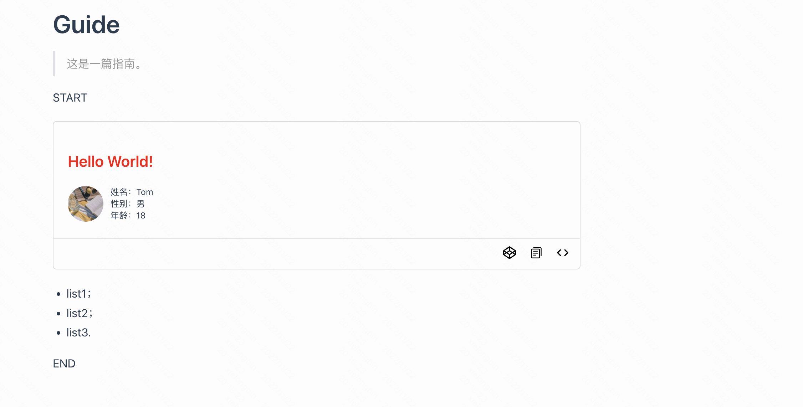

# 原理

> 插件基于 `vuepress-plugin-demo-container` 开发，如果你对它的源码感兴趣，可移步：<https://docs.chenjianhui.site/vuepress-plugin-demo-container/zh/>

## 背景

了解这个插件的原理之前，先简单介绍一下做这个插件的需求背景。

我们知道，为了便于开发者调用组件，一些优秀的组件库都会有专门的文档站点供开发者参照使用。

而为了便于预览组件，这些站点都有特定组件用于展示这些示例的源码及渲染效果。

- [ElementUI](https://element.eleme.cn/#/zh-CN/component/button)
- [ElementPlus](https://element-plus.gitee.io/zh-CN/component/button.html)
- [AntDesign](https://ant-design.antgroup.com/components/button-cn)

观察以上三个组件库文档站的示例组件，不难发现，这些组件存在以下问题：

- 对组件源码的文本操作有局限性；

  例如，无法使用键盘的组合键对组件源码进行全选；当源码过长时，无法将在某个特定标签内的代码进行缩放或展开。

- 无法对组件源码进行编辑并重新渲染组件；

  以上三个组件库文档的示例组件都是通过跳转到如 [CodePen](https://www.codepen.io)、[CodeSandbox](https://www.codesandbox.io) 等第三方平台进行组件的编辑并重新渲染。

针对以上两个痛点，期望设计一个插件满足以下两个需求：

1. 可以对组件源码进行编辑并重新渲染组件，避免跳转第三方网站产生时间损耗；
2. 组件源码区域可以支持更完善的文本操作，同时具备某些编辑器的快捷键操作。

## 流程

利用 vuepress 库，我们可以很方便地将编写的 markdown 文档渲染成特定的格式显示在网页上。例如，将以下 markdown 格式的文本：

````markdown
# Guide

> 这是一篇指南。

START

::: demo 这是一个 demo 示例。

```vue
<template>
  <div>
    <h3>{{ greet }}</h3>
    <cpn-info name="Tom" :age="18" :gender="1" />
  </div>
</template>

<script>
export default {
  props: {
    greet: {
      type: String,
      default: 'Hello World!',
    },
  },
}
</script>

<style>
h3 {
  color: red;
}
</style>
`` ` ::: - list1； - list2； - list3. END
```
````

渲染成如下形式：



其中，`vuepress-plugin-demo-box` 插件会识别一下格式的代码：

```markdown
:::demo xxx
xxx
:::
```

并将这些代码转换成特定组件渲染到页面上。

下面，具体讲解插件的转换流程。

### 配置

使用插件的第一步是传入相关的配置信息。

#### config.js

```js
// config.js
module.exports = {
  plugins: [
    [
      require('vuepress-plugin-demo-box'),
      {
        cpnLibUrl: 'https://cdn.jsdelivr.net/npm/demo-ui',
        cpnStyleUrl: 'https://cdn.jsdelivr.net/npm/demo-ui/dist/demo-ui.css',
      },
    ],
  ],
}
```

在 `config.js` 中引入插件 `vuepress-plugin-demo-box`，`cpnLibUrl` 和 `cpnStyleUrl` 分别代表组件库的 js 和 css 的 CDN 地址，这两个地址将会作为 props 传入到 `DemoBox` 这个组件中，用于跳转到 CodePen 第三方网站中渲染及编辑组件。

#### enhanceApp.js

```js
// enhanceApp.js
import DemoUI from 'demo-ui'
import 'demo-ui/dist/demo-ui.css'

export default ({ Vue }) => {
  Vue.use(DemoUI)
}
```

在 `enhanceApp.js` 中引入组件库及其样式，将组件库中的组件注册为全局组件（本质上通过 `Vue.component()` 方法注册），页面的 template 标签内直接使用组件即可。

### renderContainer

> 基于 [markdown-it-container](https://github.com/markdown-it/markdown-it-container) 识别 `:::demo xxx` 开头和 `:::` 结尾的两个标识符，并将其转换成 HTML 格式的注释标签，防止两个标识符之间的代码被 vuepress 转换。

Before:

````markdown
::: demo 这是一个 demo 示例。

```vue
<template>
  <div>
    <h3>{{ greet }}</h3>
    <cpn-info name="Tom" :age="18" :gender="1" />
  </div>
</template>

<script>
export default {
  props: {
    greet: {
      type: String,
      default: 'Hello World!',
    },
  },
}
</script>

<style>
h3 {
  color: red;
}
</style>
`` ` :::
```
````

Transform:

```markdown
<DemoBox>
  <template slot="demo">
    <!--pre-render-demo:
      <template>
        <div>
          <h3>{{ greet }}</h3>
          <cpn-info name="Tom" :age="18" :gender="1" />
        </div>
      </template>
      <script>
      export default {
        props: {
          greet: {
            type: String,
            default: 'Hello World!'
          }
        }
      }
      </script>
      <style>
      h3 {
        color: red;
      }
      </style>
    :pre-render-demo-->
  </template>
  <div slot="description">
    这是一个 demo 示例。
  </div>
  <template slot="source">

  <!--beforebegin-->

    <div class="language-markdown extra-class">

  <!--afterbegin-->

    <pre v-pre class="language-markdown">
      <code>
        <span>...</span>
        <span>...</span>
        <span>...</span>
        <span>...</span>
      </code>
    </pre>

  <!--beforeend-->

    </div>

  <!--afterend-->

  </template>
</DemoBox>
```

### renderMarkdown

重写 vuepress 内部的 `markdown.render` 方法，在其渲染结果的基础上，读取 `pre-render-demo` 这个注释标签的内容，使用 `@vue/compiler-sfc` 里的 `compileTemplate` 方法将 `template` 和 `script` 标签里的内容编译为 render 函数，并且将其作为整个页面的子组件引入，重写的 `markdown.render` 方法最后返回的结果为符合 Vue Template 语法的代码块。

示例页面代码后续将被 `vue-loader` 处理，编译为最终文档。

## DemoBox

### 源码编辑

使用 vue-codemirror 第三方库，为组件的源码提供便捷的文本操作，同时支持 Sublime 编辑器的一些常用快捷键命令。

### 跳转至 CodePen

通过抽离出组件的 HTML、JS、CSS 代码，将其拼接到请求参数中并向 CodePen 发送一个表单请求，即可在 CodePen 中渲染出对应的组件并支持修改重新渲染组件。这种情况下，Vue 和组件库的 JS 代码都需要通过 script 引入，所以需要事先传入 Vue 和组件库的 CDN 地址。

### 编辑源码后渲染组件

插件支持直接在文档中修改源码后点击保存重新渲染组件，本质上是通过 `Vue.extend()` 方法新建一个 Vue 的子类，调用这个子类的 `$mount()` 方法创建组件实例并挂载到页面上。

因为需要利用到 Vue 这个对象，所以在 DemoBox 组件挂载之后，通过往 HTML 页面的 head 标签里插入 script 的形式，将 Vue 添加到全局对象 window 中。之后，以同样的方式插入组件库的 script，将组件库中的组件注册为全局组件，这样通过 `window.Vue.extend()` 的方式扩展一个组件类时，就能识别出 template 中的全局组件。

最后，调用这个组件类的 `$mount()` 方法，即可新建组件实例并将其挂载到页面上，从而实现了组件的重新渲染。
